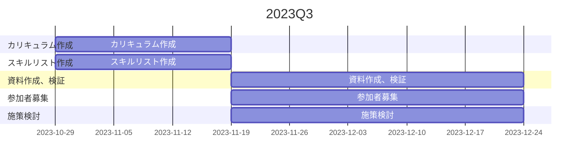
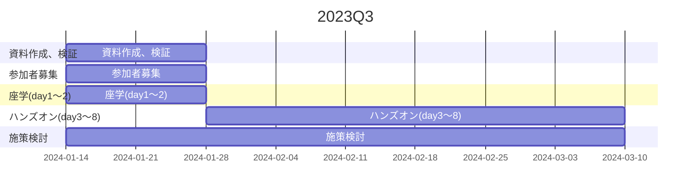

## クラウド技術を学ぶ必要性
（昨今の事情を書きたい）

## 目指すべき社員像
以下の社員像を目指して、育成を行っていく。AWS資格試験の試験対策に特化した活動は行わない。1と2ができる社員が増えてくれば、今後勉強会を開く必要性もなくなると考えている。

:smile_cat:

1. AWSに興味を持っている
1. 自ら進んで楽しんで学習ができている
1. Webサイト運用に必要とされるAWSサービスを覚えて、実際にサービスを作成できるようになっている

## 育成対象者

方針としては以下の社員を育成対象者として、勉強会参加の声をかけていく。

1. 新人
1. 2～3年目
1. 希望者
   

新人が1番の理由は、新人研修の延長で学ぶというモチベーションが高いため。またその翌年に後輩に教えるということを期待しているため。
新人以外は勉強時間の確保がは難しい傾向になるので、新人ほど勧誘は行わない。また無理やり参加させる自体にならないよう注意を払っていかなければならない。

## 育成に必要な資料

| 有無 | 必須 | 資料の内容                                                                                    | 目的                                                                                                 | 備考                                                                 | 
| ---- | ---- | --------------------------------------------------------------------------------------------- | ---------------------------------------------------------------------------------------------------- | -------------------------------------------------------------------- | 
| 〇   | 〇   | AWSの紹介とクラウド市場の動向を知る内容（座学用資料）                                         | AWSに興味を持ってもらう                                                                              |                                                                      | 
| 〇   | 〇   | AWSの基本的なサービスを知る資料（座学用資料）                                                 | AWSに興味を持ってもらう                                                                              |                                                                      | 
| 〇   | 〇   | AWSマネジメントコンソールの操作体験資料。mattermostのスプレッドシート（ハンズオン用資料）       | AWSに興味を持ってもらう                                                                              |                                                                      | 
| ×    | 〇   | 勉強会紹介資料（座学用資料）学習スケジュール、育成者が覚えるAWSサービスの一覧（スキルリスト） | 勉強会勧誘時に使う説明資料。ハンズオンで作成するサービスを管理するため。育成者のレベルを管理するため | 作成中                                                               | 
| ×    | 〇   | ハンズオン用資料                                                                              | スキルリストに書いてあるサービスを作成する手順が書かれている。詳細な手順書は作らない。               | 作成中。                                                             | 
| ×    | 〇   | フィードバック用アンケート                                                                    | 座学とハンズオン実施後に育成者からフィードバックをもらうため                                         | 未着手                                                               | 
| ×    | △   | 費用補助に関する資料。書籍購入、Udemy受講費用等が会社から補助があることを知らせる資料。       | 学習意欲向上                                                                                         | なくても勉強会勧誘時に説明すればカバーできる                         | 
| ×    | △   | 勉強会参加申し込みアンケート                                                                  | 随時勉強会参加を受け付けるため。本人の意思ではない参加を防ぐため。                                   | あった方が管理は楽かもしれない。                                     | 
| ×    | △   | AWSアカウント作成資料                                                                         | AWS管理者の負担軽減                                                                                  |                                                                      | 
| △   | ×    | CLF合格対策。 動画資料あり（座学用資料）                                                   | CLF試験合格                                                                                          | 中途半端な資料を作成済。試験範囲全体を教える時間がないため行わない。 | 

<!-- 
https://www.webfx.com/tools/emoji-cheat-sheet/
-->

## 2023年下期スケジュール

## 勉強会シナリオ
勉強会テーマ：「実際に手を動かしてみる」
- 検証も兼ねるので大人数は受け入れられない
- 講師一人あたり、３人ぐらいの育成者を持つことを考えているが決定ではない。少人数制にして発言がしやすい環境にしたい。
- awsアカウントは個人のもので可
- 各勉強会は詰め込まないようにする代わりに、回数を増やす。
- 座学は短く、ハンズオンは長目に時間を取る

| 勉強会 | 場所・開催形式               | 時間 | 内容                                                                                                        | 資料                                                                      | 当日まで育成者側の準備 | 
| ------ | ---------------------------- | ---- | ----------------------------------------------------------------------------------------------------------- | ------------------------------------------------------------------------- | ---------------------- | 
| day1   | 全員で本社で集合研修（座学） | 1H   | AWSの紹介とクラウド市場の動向を知る クラウド市場で求められる人物像を知る 今後の勉強会の進め方を知る。 | クラウドを学ぶ必要性を説く資料 AWSの概要を説明する資料 カリキュラム | ＡＷＳ入門用動画を見る | 
| day2   | 全員で本社で集合研修（座学） | 1H   | AWSの概要を知る（ハンズオンで使うサービスだけでもOK）                                                       | AWSのサービスを説明する資料。動画でもOK                                   |                        | 
| day3   | web開催                      | 2H   | マネジメントコンソールを知る AWSのEC2の基本操作を知る                                                    | 作成中                                                                    |                        | 
| day4   | web開催                      | 2H   | Webサイト運用に必要な14のAWSサービスを知ろう（前編）                                                        | 作成中                                                                    |                        | 
| day5   | web開催                      | 2H   | Webサイト運用に必要な14のAWSサービスを知ろう（中編）                                                        | 作成中                                                                    |                        | 
| day6   | web開催                      | 2H   | Webサイト運用に必要な14のAWSサービスを知ろう（後編）                                                        | 作成中                                                                    |                        | 
| day7   | web開催                      | 2H   | AWS初級資格（CLF)の問題を全員で解いてみる。自分の理解度を知る。ベンダー試験がどういうものか知る。           | Udemyの模擬試験                                                           |                        | 
| day8   | web開催                      | 2H   | 育成者からのリクエストに応じる会                                                                            | 作らない                                                                  |                        | 

## スキルリスト

| #   | day  | カテゴリ                                         | スキル                                                          | 時間              |     | 
| --- | ---- | ------------------------------------------------ | --------------------------------------------------------------- | ----------------- | --- | 
| 1   | day4 | 管理とガバナンス                                 | CloudTrailを知っている。証跡を確認することができる              | 20分　※合計100分 |     | 
| 2   |      | ネットワーキングとコンテンツ配信                 | VPCを知っている。作成ができる                                   | 15分              |     | 
| 3   |      | ネットワーキングとコンテンツ配信                 | セキュリティグループを知っている。作成ができる                  | 15分              |     | 
| 4   |      | コンピューティング                               | EC２インスタンスを知っている。作成ができる                      | 30分              |     | 
| 5   |      | ストレージ                                       | S3を知っている。作成ができる                                    | 20分              |     | 
| 6   | day5 | データベース                                     | RDSを知っている。作成ができる                                   |                   |     | 
| 7   |      | ネットワーキングとコンテンツ配信                 | CloudFrontを知っている。作成することができる                    |                   |     | 
| 8   |      | ネットワーキングとコンテンツ配信                 | Route53を知っている、ホストゾーンを作成することができる         |                   |     | 
| 9   |      | セキュリティ、アイデンティティ、コンプライアンス | WAF & Shieldを知っている。WAF（ルール）を作成することができる   |                   |     | 
| 10  |      | セキュリティ、アイデンティティ、コンプライアンス | Certificate Manageを知っている。SSL証明書を作成することができる |                   |     | 
| 11  | day6 | 管理とガバナンス                                 | CloudWatchを知っている。アラート設定を作成することができる      |                   |     | 
| 12  |      | コンピューティング                               | Lambdaを知っている。作成することができる                        |                   |     | 
| 13  |      | コンピューティング                               | AutoScallingを知っている。作成することができる                  |                   |     | 
| 14  |      | クラウド財務管理                                 | Cost Explorerを知っている。費用を確認することができる           |                   |     | 

### CloudTrail（15分）
#### 要件
- ログを取る設定をする→必要か？後日調整

#### 動作確認
- CloudTrailコンソールからイベント履歴を閲覧できる。

#### 手順書

[https://www.sunnycloud.jp/column/20220904-01/:title]

#### 検証メモ
- 11/6 21:35-21:55 20分かかった。
- 手順書は操作が書いてなかったので変更した。

[https://qiita.com/leomaro7/items/c1457699c96d08adfc33:title]

- 「証跡の作成」ボタンを押さないと取得が始まらない。→これは間違い。コンソールで履歴を見たいだけなら不要。ボタン押すとS3にログが保存される。90日以上保存するには必要な操作である。保存されると削除しなければならないので、作成はやめておこう。また中身を見ても理解できない。cloudtrailにいくとボタン押させるような誘導になっているので注意がいる。
- マネジメントコンソールへのログインのイベントは見えてないのか、またはどのイベントなのか判別できないのか、わからない。ec2作成はわかりやすい名前でイベント名が出た
- 操作はec2作成と削除を行った。よってec2の操作がまだできてないかもなので、順番はday4の最後がいいかもしれない。
- 手順書は読んできてもらえば20分もあれば十分であろう。

[f:id:tmoritoki0227:20231106215641p:plain]
[f:id:tmoritoki0227:20231106215712p:plain]

- 履歴はすぐには出てこない。3分ぐらい待った方がよい

### VPC（5分）
#### 要件
- VPCが作成できる

#### 動作確認
- EC2のときに確認する

#### 手順書

[https://cloud5.jp/tatsuoka-handson-beginner-vpc/:title]

#### 検証メモ
- 11/7 20:50 - 21:05 15分かかった
- 画面によって、VPC作成ボタン押したときのデフォルトの設定が違う。「VPCなど」の方が楽で、初心者にはこれで十分。外部とインターネットするための最低限のリソースを作成してくれる。最初に紹介した手順書には載ってないので、手順書変えるべき。「VPCなど」を選択して作ることを推奨しておきたい。ダッシュボードでVPC作成ボタンを押すとこれがデフォルト。
  - VPCのみ　＜＝非推奨。こちらの手順は[https://cloud5.jp/tatsuoka-handson-beginner-vpc/:title]
  - VPCなど　＜＝推奨。こちらの手順は[https://dev.classmethod.jp/articles/vpc-beginner-2023/:title]
  - 作成したリソースに課金はされないが、邪魔なので消しておきたい。VPC削除ですべて消えるのかわからない
[f:id:tmoritoki0227:20231107210707p:plain]

### セキュリティグループ（10分）
#### 要件
- セキュリティグループの作成
- インバウンドの80 ポートを許可

#### 動作確認
- EC2のときに確認する

#### 手順書

[https://cloud5.jp/tatsuoka-handson-beginner-vpc/:title]

#### 検証メモ
- 11/7 20:10 - 21:25 15分かかった
- 手順ではセキュリティグループを作成する手順が載っていたなかったので、[https://www.cloudsolution.tokai-com.co.jp/white-paper/2021/0927-257.html:title]に変えた。

### EC2（15分）
#### 要件
- キーペアを作成する（作成済であれば不要。作り直しも不要）
- 作成したVPCを使うこと
- 作成したセキュリティグループを使うこと
- WEBサーバをインストールすること
- EC2作成後、EC2停止・起動・削除ができること

#### 動作確認
- EC2にログインできる。（ssh接続 or インスタンスコネクト）
- webブラウザからweb画面を表示できる

#### 手順書

[https://cloud5.jp/tatsuoka-handson-beginner-vpc/:title]
[https://www.youtube.com/watch?v=oKdkO_abZRw&t=74s:title]

#### 検証メモ
- 11/8 19:40-20:40
- [https://cloud5.jp/tatsuoka-handson-beginner-vpc/:title]ではちょっと難しいし、長い
[https://cloud5.jp/tatsuoka-handson-beginner-vpc/:title]でキーペア作成、ec2作成、停止削除がわかる

- 以下の手順を提案
  - [https://www.cloudsolution.tokai-com.co.jp/white-paper/2021/0927-257.html:title]
  - [https://www.youtube.com/watch?v=oKdkO_abZRw&t=74s:title]
  - [https://github.com/tmoritoki0227/cloudnative-hands-on/blob/main/Aws.md:title]

- webサーバのインストール手順がredhat系のコマンドなので、amanzonlinuxが必要。ubuntuはできないので、amazonlinuxを要件にいれるか。
- インスタンスコネクトは作成時に設定が１ついる
- サブネットのデフォルトがprivateで見間違えててログインできなかった。
- 60分かかってしまったが実質30分だろう。
- ここまで1時間１5分

### S3（20分）
#### 要件
- bucket作成
- html作成

#### 動作確認
- webブラウザからweb画面を表示できる

#### 手順書

[https://www.sunnycloud.jp/column/20211101-01/:title]

#### 検証メモ
- 11/9 20:55-21:15 20分
- 手順がちょっと古い。[https://blog.serverworks.co.jp/2022/09/06/212352#S3-%E3%83%90%E3%82%B1%E3%83%83%E3%83%88%E3%82%92%E4%BD%9C%E6%88%90:title]
- やり直しを含めて全体で９５分。
- このあと一回削除して、もう1度最初からやり直してできるところまでやる。時間が来たらまた全部削除する。
- 120分あるが、遅くても演習は10分前に終わりたい。
- 時間が足りなさそうであればday3か後ろにハンズオンに時間を割いてもいい

## 学習意欲向上施策案

1. キックオフ食事会。講師との距離を縮める。奢って恩を売り、途中フェードアウトを抑止する。
2. たまに軽い食事会を行い定期的に状況確認を行い、何もしないという状況を抑止する。放置すると何もやらない人向けの対応。
3. 勉強スケジュールを提出してもらう。内容には口出ししない。
4. 目標設定に何かしら入れてもらう。
5. ★（合格者を増やしたいなら）クラウドプラクティショナーの一回目の受験費用負担。不合格でも負担する。管理部との交渉が必要となる。
6. ★（合格者を増やしたいなら）書籍購入費補助。管理部との交渉が必要となる。現在でも補助しているケースがあると思うがよりハードルを下げたい。〇フーではUdemyは受講し放題のプランのようだ。
7. ★（結局これが１番大事）学習の必要性を感じさせる定期的な情報発信。これは会社側の立場の人から発信することが望ましい。
   1. クラウドの求人が多いこと
   2. 会社が求めているということを理解してもらう。会社が求めていない技術習得はしないと思う。
   3. 学習することへのメリットを伝える。給与UPに繋がることが１番いい。
   4. AWSの人を呼んで講演してもらう。
   5. 初心者向けのAWS動画が手に入ったので常時公開しておくか。動画は11/23まで公開されている
   6. 今後のキャリアパスを考える。
   7. AWS業務従事者との座談会を開く。資料は求めない。
8. 講師を若手にチェンジする。その方が会話も弾むと期待する。
9.  公にはできないと思われるが、工数を少し使ってよいのであれば、説明しておく。
10. 資格試験に合格したら、勉強方法を書いてもらう。先輩の書いた記事を見たらやる気を出してもらえないか。
11. 全員一か所に集めてハンズオン研修を行う。一人だとやる気が出ない人向け対策
    1.  会社だとハンズオンがやりずらいのではないか？モニターがないことや、PCを持っていくなどの手間がかかる。
12. どうやって進めてほしいか、育成者と座談会を開く
13. よく褒めて、やる気を出させる。
14. wauのグループチャットを部屋を用意する。いままで質問を受けたことがない。何故だろうか？そこに改善ポイントがあるのかも
15. 講師が上位資格を取る。ただの素人に説明されるよりはやる気が出ると思う。
16. AWSのアカウントを自分で開設してもらう。その方がやりやすい人もいるだろう
    1.  費用補助はできないか？１年間は無料なので必要はないかもしれないが。
17.
1.  課金されることの不安を解消してあげる。課金されるもの、されないものを教える。課金されてもいいケースがあることを理解してもらう。
2.  AWSのイベント参加。2024/1/18 に初心者向けに演習を行う[イベント](https://aws.amazon.com/jp/events/builders-online-series/?trkCampaign=builders-online-series&trk=cc07e81e-728b-486a-a638-fe8cd4787e01&sc_channel=em)がある
3.  転職サイトを育成者とみる。
4.  初心者向け動画をたくさん集める。やはりプロの説明が分かりやすい。

## 課題
1. awsを好き勝手に使えない。一定のルールがあるのは分かるが、課金を怖がられるとやる気の阻害になる。
2. 文章を保存する場所がない。要件は自宅のPCからアクセスできること。共同編集できること。
   1. 梅松さん準備中
3. AWSアカウント作成するのが手間？
   1. 手順書を作って将来的には誰でもできるようにしよう。またIAMユーザを作るだけのユーザを作ればよい。

## Q & A
### AWSの業務未経験者が講師となるのは適しているのか？

適してはいないと考えているが、いないものは仕方がない。今後業務経験者の参画を待ちつつ、やれることを行って次の講師へバトンタッチしましょう。

### AWSイベントスケジュール
以下はAWSの一部のイベントを掲載しています。AWSにはたくさんのイベントがあります。社内でイベント開催の案内を行い、興味を持つ人を増やしていきたいと考えている。中でもおすすめなのが[AWSSomeDay](https://aws.amazon.com/jp/events/awsome-day/awsome-day-online/)です。これはAWSをこれから学ぼうとする人向けのイベントで、我々の勉強会参加の前に参加させたいです。

| 月   | イベント     | コメント       | 
| ---- | ------------ | -------------- | 
| 4月  | AWSサミット  | 定期開催       | 
| 5月  |              |                | 
| 6月  | aws someday  | やや不定期開催 | 
| 7月  | 新人配属     |                | 
| 8月  |              |                | 
| 9月  | aws someday  | やや不定期開催 | 
| 10月 | aws サミット | 定期開催       | 
| 11月 | aws someday  | やや不定期開催 | 
| 12月 |              |                | 
| 1月  |              |                | 
| 2月  | aws someday  | やや不定期開催 | 
| 3月  |        |                | 

## 育成対象者がAWSに興味を示している行動例

育成対象者がAWSに興味を持っているのか、無理やりやらされているのか講師側からみたらよくわからない。そこで次のような行動から興味を持っていると判断していきたい。

1. wau talkからの情報発信を読んでくれる。いいねがつく。
1. クラウドの学習する必要性を説明する説明会に参加
1. 勉強会参加
1. 勉強会の内容について上司などに質問している
1. AWSイベントに参加している
1. AWSの書籍を買った、買おうとしている。AWSの資格試験を受験した。受験勉強している。
1. AWSのアカウントを開設した。会社にアカウント作成依頼をしている

これらが意味があるかわからないが頭に入れておこう。

